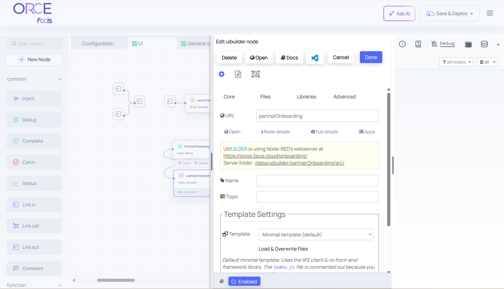
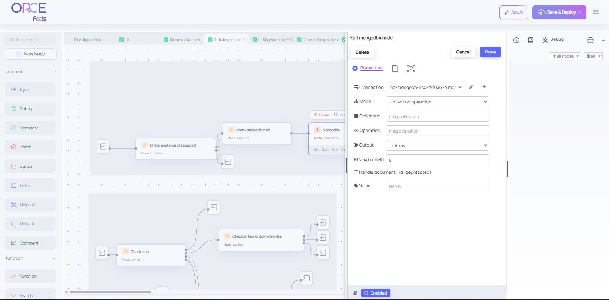
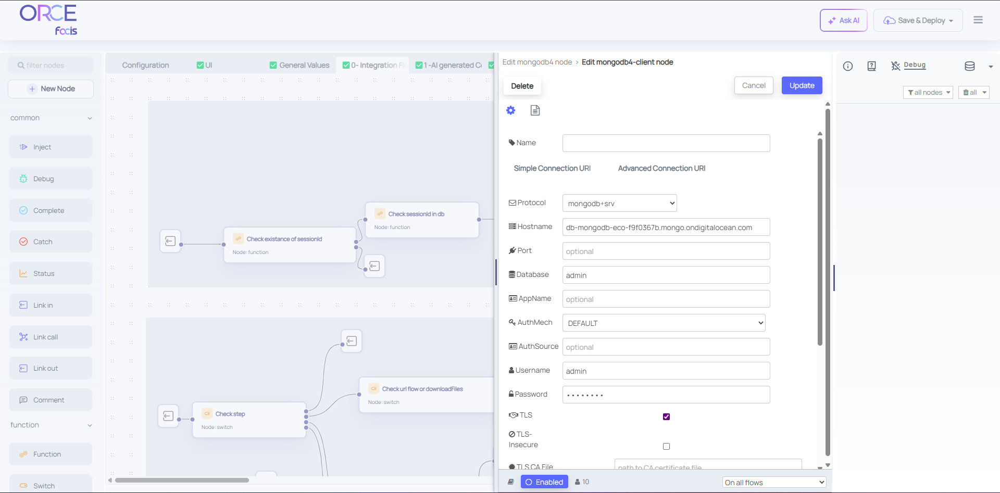

# **Deployment Guide for Onboarding Platform**

---

## **Step 1 — Import the Flow and Apply Required Configurations**

This step covers importing your `onboarding.json` flow into your **ORCE engine**, setting the **uibuilder URL**, and configuring the **MongoDB** connection used by the **0-Integration Flow** (and any other Mongo nodes).

---

### **1.1 Import the onboarding.json Flow**

1. Open **engine → Menu ≡ → Import (Ctrl + I)**
2. Paste or upload your flow `onboarding.json`
3. Click **Import** (do not press Deploy yet)

---

### **1.2 Configure the uibuilder node**

In the ✅ **UI flow**, locate the **uibuilder node** and set the base URL for your UI.

Open the node → **URL** — e.g., `/partneronboarding` (choose a short, unique path).  
Make sure it does not conflict with other HTTP paths.

---

### **1.3 Configure MongoDB Connection**

Locate the **MongoDB node** used in the ✅ **0 Integration Flow** (or any other MongoDB node).  
Before deploying the flow, open the MongoDB node, click the pencil icon next to the connection field, and fill in the following parameters:

Username: `yourUsername`  
Password: `yourPassword123`  
Host: `mongodb+srv://your-cluster.mongodb.net`  
Database: `yourDatabaseName`

> **Note:** Once you configure one MongoDB node and update its connection, all MongoDB nodes that reference the same configuration will automatically inherit the updated settings.  
> By default, the configuration is shared across the flow, so there’s no need to manually edit every Mongo node individually.  
> After entering these details, click **Update** and then **Done**.

---

### **1.4 General Values Flow Configuration**

There is a flow named **“General Values”** which contains several predefined static data items.  
Among these values are:

- `apiAiKey` — the API key used to communicate with OpenAI (this key will be provided to you).  
- `Checksum` — used for syncing vc files; default values are already included.

If you need to modify these parameters according to your own environment or project requirements, make sure to update them **before clicking Deploy**.  
Any changes made after deployment will require redeploying the flow for them to take effect.

---

### **1.5 Deploy the Flow**

Finally, click the **Deploy** button.  
If everything is configured correctly, the deployment will complete successfully.  
Otherwise, you may see an error or warning message — review and resolve any configuration issues before retrying.

---

## **Step 2 — Uploading uibuilder Source Files**

After importing and configuring your engine flow, upload the **uibuilder source files** so the front-end interface loads correctly.

---

### **2.1 Locate the uibuilder Directory**

Navigate to the following path in your engine file browser:

https://{your-domain}/fscloud/files/data/uibuilder/{your-uibuilder-url}/src/

yaml
Copy code

Inside the uibuilder directory, locate the folder named after the URL path set in the uibuilder node (e.g., `/partnerOnboarding`).  
Enter this folder and open the `src` subdirectory — this contains your front-end source files.

---

### **2.2 Upload the Source Files**

1. Prepare your UI source package (e.g., `src-onboarding.zip`) and unzip it locally.  
2. Inside, locate `index.html`, `index.js`, `index.css`, etc. and other related assets.  
3. In the engine File Browser, click the **Upload (↑)** button in the top right.  
4. Select and upload all extracted files and the **PIC** folder included in the ZIP.

---

### **2.3 Verify the Upload and UI Functionality**

After uploading, return to the *engine editor**.  
Double-click the **UI Builder node** and click the **Open** button.  
If the UI loads correctly in a new browser tab, the UI Builder has been successfully launched and all files are in place.

---

✅ **Deployment Complete!**
